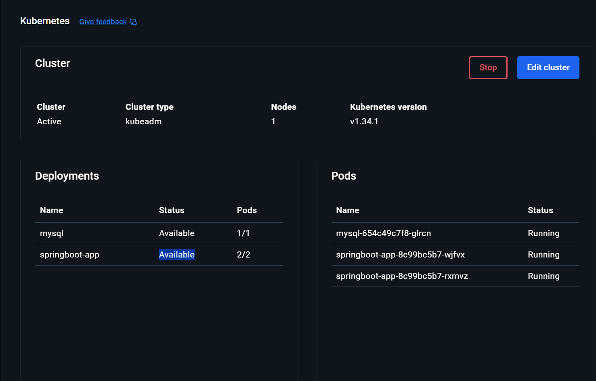

# Spring Boot + MySQL (Docker Compose Demo)

## Giới thiệu

Dự án này minh họa cách **đóng gói và chạy một ứng dụng Spring Boot** với **MySQL** bằng **Docker Compose**.  
Ứng dụng cung cấp một REST API đơn giản để quản lý `Product` (sản phẩm), với các thao tác thêm, xem và lấy danh sách.




---

##  Yêu cầu môi trường

Trước khi chạy, đảm bảo máy bạn đã cài:
- [Docker Desktop](https://www.docker.com/products/docker-desktop)
- [Java JDK 17+ hoặc 21](https://adoptium.net/)
- [Apache Maven 3.8+](https://maven.apache.org/download.cgi)
- (Tùy chọn) [Visual Studio Code](https://code.visualstudio.com/)

---

## Hướng dẫn chạy

### Build ứng dụng Spring Boot
Mở terminal (PowerShell hoặc VS Code Terminal) tại thư mục chứa `pom.xml`:
```bash
    mvn -q -DskipTests package
    docker compose up -d --build
    docker compose ps
```


Kết quả mong đợi:


Mở trình duyệt:
👉 http://localhost:8080

Hoặc kiểm tra API qua terminal:

Lấy danh sách sản phẩm
curl http://localhost:8080/api/products

Thêm sản phẩm mới
curl -X POST http://localhost:8080/api/products \
     -H "Content-Type: application/json" \
     -d "{\"name\":\"Macbook Pro\",\"price\":3500}"


Kết quả:

[
  { "id": 1, "name": "Macbook Pro", "price": 3500.0 }
]
