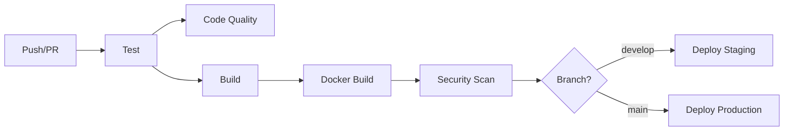

# CI/CD Pipeline với GitHub Actions

Pipeline CI/CD này được thiết kế cho ứng dụng Java Spring Boot với deployment trên Kubernetes.

## 🚀 Tính năng

### 1. Continuous Integration (CI)
- **Build & Test**: Compile code và chạy unit tests
- **Code Quality**: Phân tích chất lượng code với SonarCloud
- **Security Scan**: Kiểm tra bảo mật dependencies và container images
- **Docker Build**: Build và push Docker images lên GitHub Container Registry

### 2. Continuous Deployment (CD)
- **Staging Deployment**: Tự động deploy khi merge vào branch `develop`
- **Production Deployment**: Tự động deploy khi merge vào branch `main`
- **Blue-Green Deployment**: Deployment không downtime

### 3. Additional Features
- **Load Testing**: Chạy performance tests với JMeter
- **Security Scanning**: Daily security scans
- **Dependency Updates**: Tự động cập nhật dependencies với Dependabot
- **Release Management**: Tự động tạo releases khi push tags
- **Cleanup**: Tự động dọn dẹp old artifacts và images

## 📋 Workflows

### Primary Workflows

1. **`ci.yml`** - Main CI/CD pipeline
   - Triggers: Push to `main`/`develop`, Pull requests
   - Jobs: Test → Code Quality → Build → Docker → Security → Deploy

2. **`security.yml`** - Security scanning
   - Triggers: Daily schedule, Manual dispatch
   - Jobs: Dependency scan, Container scan

3. **`release.yml`** - Release management
   - Triggers: Push tags (v*)
   - Jobs: Build release artifacts, Create GitHub release

4. **`load-test.yml`** - Performance testing
   - Triggers: Manual dispatch
   - Jobs: Run JMeter load tests

5. **`cleanup.yml`** - Resource cleanup
   - Triggers: Weekly schedule
   - Jobs: Clean old images, artifacts, cache

## 🔧 Setup

### 1. Repository Secrets

Cần thiết lập các secrets sau trong GitHub repository:

#### Container Registry
```
GITHUB_TOKEN (tự động có sẵn)
```

#### SonarCloud (optional)
```
SONAR_TOKEN - Token từ SonarCloud
```

#### Kubernetes Deployment
```
KUBE_CONFIG_STAGING - Kubeconfig cho staging environment
KUBE_CONFIG_PRODUCTION - Kubeconfig cho production environment
```

#### Notifications (optional)
```
SLACK_WEBHOOK_URL - Webhook URL cho Slack notifications
```

### 2. Environment Protection Rules

Thiết lập protection rules cho environments:

#### Staging Environment
- Reviewers: Development team
- Wait timer: 0 minutes

#### Production Environment
- Reviewers: DevOps team + Tech leads
- Wait timer: 5 minutes
- Deployment branches: `main` only

### 3. Branch Protection Rules

#### Main Branch
- Require pull request reviews (2 reviewers)
- Require status checks to pass
- Require branches to be up to date
- Restrict pushes to admins only

#### Develop Branch
- Require pull request reviews (1 reviewer)
- Require status checks to pass

## 🏗️ Workflow Details

### CI Pipeline Flow



### Jobs Sequence

1. **Test Job**
   - Setup Java 17
   - Cache Maven dependencies
   - Run unit tests
   - Generate test reports
   - Upload test artifacts

2. **Code Quality Job**
   - Run SonarCloud analysis (if configured)
   - Generate quality reports

3. **Build Job**
   - Compile application
   - Package JAR file
   - Upload build artifacts

4. **Docker Job**
   - Build multi-platform images (amd64, arm64)
   - Push to GitHub Container Registry
   - Tag with branch name and commit SHA

5. **Security Job**
   - Scan container for vulnerabilities
   - Upload results to GitHub Security tab
   - Fail on HIGH/CRITICAL vulnerabilities

6. **Deploy Jobs**
   - Update Kubernetes manifests
   - Apply to cluster
   - Wait for rollout completion
   - Run smoke tests (production only)

## 🔒 Security Features

### Vulnerability Scanning
- **Trivy**: Container image scanning
- **OWASP Dependency Check**: Java dependencies scanning
- **GitHub Security Advisories**: Automatic vulnerability alerts

### Security Policies
- No secrets in code
- Signed commits (recommended)
- Dependency updates via Dependabot
- Regular security scans

## 📊 Monitoring & Observability

### Build Metrics
- Build success/failure rates
- Test coverage reports
- Build duration tracking

### Deployment Metrics
- Deployment frequency
- Lead time for changes
- Mean time to recovery
- Change failure rate

### Security Metrics
- Vulnerability counts by severity
- Dependency age
- Security scan results

## 🚀 Usage Examples

### 1. Standard Development Flow
```bash
# Create feature branch
git checkout -b feature/new-feature

# Make changes and commit
git add .
git commit -m "feat: add new feature"
git push origin feature/new-feature

# Create pull request → CI runs automatically
# After review and merge → CD deploys to staging
```

### 2. Production Release
```bash
# Merge to main → auto deploy to production
git checkout main
git pull origin main

# Create release tag
git tag v1.0.0
git push origin v1.0.0  # Triggers release workflow
```

### 3. Manual Load Testing
1. Go to GitHub Actions tab
2. Select "Load Testing" workflow
3. Click "Run workflow"
4. Choose environment and parameters
5. Monitor results

### 4. Emergency Rollback
```bash
# Rollback Kubernetes deployment
kubectl rollout undo deployment/k8s-demo-app -n k8s-demo

# Or redeploy previous image
kubectl set image deployment/k8s-demo-app \
  app=ghcr.io/username/repo:previous-tag \
  -n k8s-demo
```

## 🔧 Troubleshooting

### Common Issues

1. **Build Failures**
   - Check Java version compatibility
   - Verify Maven dependencies
   - Review test failures

2. **Docker Build Issues**
   - Verify Dockerfile syntax
   - Check base image availability
   - Review build context

3. **Deployment Failures**
   - Verify Kubernetes connectivity
   - Check resource quotas
   - Review pod logs

4. **Security Scan Failures**
   - Review vulnerability reports
   - Update dependencies
   - Check base image security

### Debug Commands
```bash
# Check workflow logs
gh run list
gh run view [run-id]

# Check deployment status
kubectl get pods -n k8s-demo
kubectl describe deployment k8s-demo-app -n k8s-demo
kubectl logs -f deployment/k8s-demo-app -n k8s-demo
```

## 📈 Metrics Dashboard

Monitor your pipeline with these metrics:

- **Build Health**: Success rate, duration, frequency
- **Test Quality**: Coverage, failures, flaky tests
- **Security Posture**: Vulnerabilities, outdated dependencies
- **Deployment Success**: Deploy frequency, rollback rate
- **Performance**: Load test results, response times

## 🤝 Contributing

1. Fork the repository
2. Create a feature branch
3. Make your changes
4. Add tests for new functionality
5. Ensure CI passes
6. Create a pull request

## 📝 Additional Resources

- [GitHub Actions Documentation](https://docs.github.com/en/actions)
- [Kubernetes Documentation](https://kubernetes.io/docs/)
- [Spring Boot Documentation](https://spring.io/projects/spring-boot)
- [Maven Documentation](https://maven.apache.org/guides/)
- [Docker Documentation](https://docs.docker.com/)